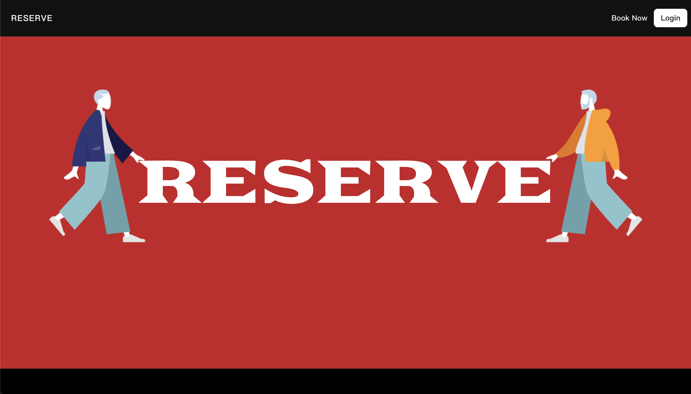

# 咖啡廳訂位系統 Cafe Reservation - RESERVE
- RESERVE 是一個提供咖啡廳訂位系統的網站。
- 使用者經身份驗證後，可探索並收藏喜愛的咖啡廳。亦可根據特定日期、時段和人數的條件篩選並預訂座位。
- 使用者亦可新增成為店家，瀏覽和管理顧客訂位資料，實現顧客與店家雙向交流。
- 亦有後台管理員設定，可以下架任何一間餐廳，亦可一鍵清除過期的訂位資料。
- 本專案採用前後分離的開發模式，API 透過 RESTful 風格進行設計。
## Website - 網站展示
- [咖啡廳訂位網站 Cafe Reservation](https://james-lee-01.github.io/reserve)
- [正向流程 Demo](https://youtu.be/DrG0Fo3U5aQ)
- [後端 repo](https://github.com/boxunw/cafe-reservation-api)
- 共用帳號：
  - 使用者1：
    ```
    Account: user1@example.com
    Password: 12345678
    ```
  - 使用者2：
    ```
    Account: user2@example.com
    Password: 12345678
    ```
  - 管理者：
    ```
    Account: root@example.com
    Password: 12345678
    ```



## Features - 產品功能
### 使用者：
- 使用者可以註冊/登入/編輯帳號
- 使用者可以瀏覽所有咖啡廳
- 使用者可以查看單一咖啡廳詳細資訊
- 使用者可以收藏/取消收藏喜愛的咖啡廳
- 使用者可以依日期時段及人數搜尋尚有空桌可訂位的咖啡廳
- 使用者可以增加城市別作為篩選指標
- 使用者可以經由篩選結果或是收藏清單中選取咖啡廳進行訂位
- 訂位頁面系統提供該咖啡廳 7 日內有空桌可訂位的日期和時段
- 使用者可以瀏覽自己的訂位資料
- 使用者可以新增咖啡廳成為店家

### 店家：
- 店家可以編輯咖啡廳詳細資訊，包含時段、座位桌數等
- 店家可以查看及刪除該咖啡廳的顧客訂位資料

### 後台管理者：
- 後台管理者可以瀏覽所有咖啡廳列表
- 後台管理者可以下架任何一家咖啡廳
- 後台管理者可以一鍵清除今日之前舊的訂位資料

## 開發工具
- @fortawesome: v6.4.2
- @mui/icons-material: v5.14.13
- @mui/material: v5.14.11
- @mui/x-date-pickers: v6.16.2
- Axios: v1.5.1
- React: v18.2.0
- React-dom: v18.2.0
- React-router-dom: v6.4.1
- React-scripts: v5.0.1
- Sweetalert2: v11.7.32
- Swiper: v10.3.1

## 後端合作夥伴
<div style="display: flex; align-items: center;">
  
  <span style="margin-left: 10px;"><a href="https://github.com/boxunw">Boxun Wang</a></span>
</div>